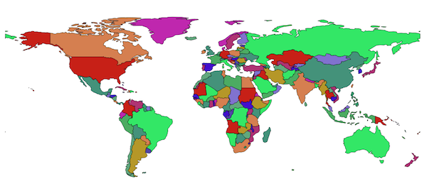
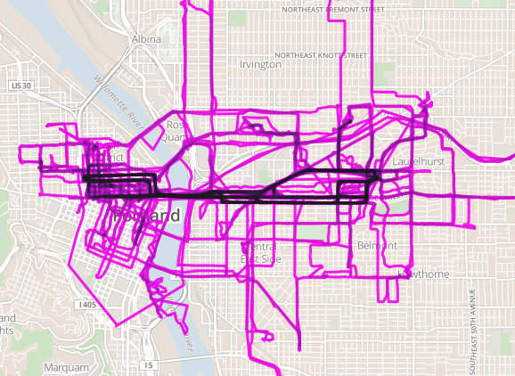
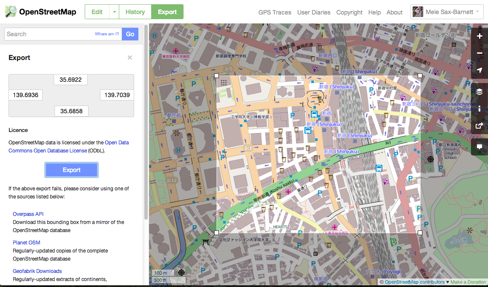
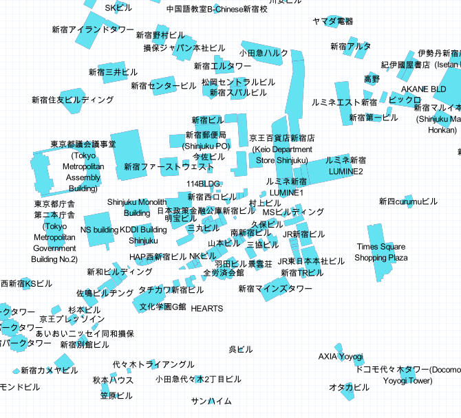
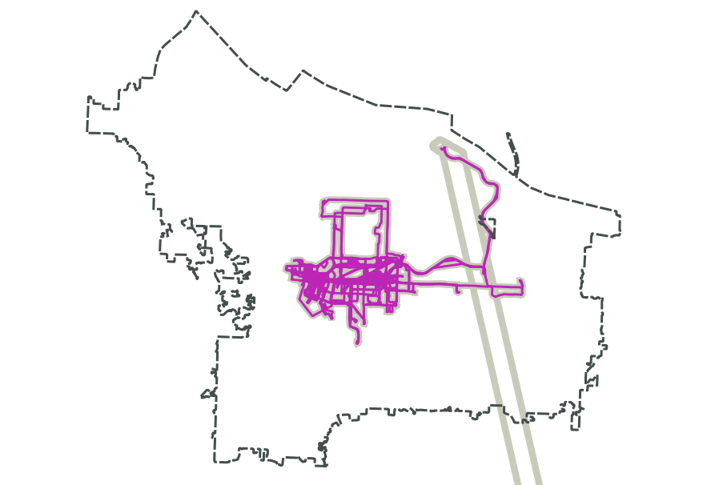
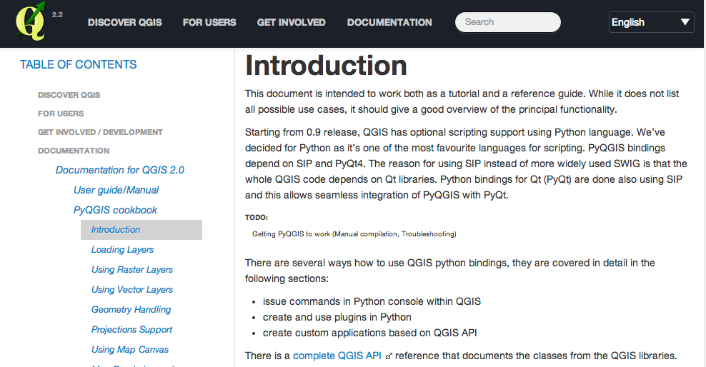
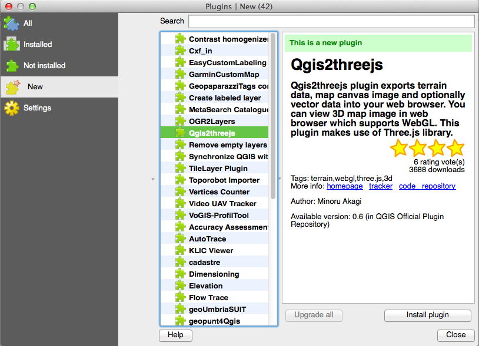

#[Python + Geodata = BFFs](http://pdxmele.com/python-geodata-bffs/index.html) 

by Mele Sax-Barnett

##Introduction

Why do I think Python and geographic data will be *best friends forever*?

I &lt;3 maps, but making them can be a pain. The worst part is getting the data to cooperate.

It usually:

* Is not in the [format](http://www.gdal.org/ogr/ogr_formats.html) [you need](http://en.wikipedia.org/wiki/GIS_file_formats)
* Has several [obvious errors](http://en.wikipedia.org/wiki/Null_Island)
* Is split up into 50 different files 
* Is in a completely different projection/coordinate system than what you need
* And has no [metadata](https://www.fgdc.gov/metadata), so you have no idea what you're even looking at

You could point and click all day in out-of-the-box [GIS](http://en.wikipedia.org/wiki/Geographic_information_system) software to get it ready, or you could add Python into the mix.

##A little about (vector) [geographic data](http://en.wikipedia.org/wiki/GIS_file_formats#Vector)

* Made up of one or several files
* Has a coordinate system/[projection](http://en.wikipedia.org/wiki/Map_projection)
* Made up of one or several "layers" of data,
	* Each of which includes a number of features
		* Each feature has geometry:
			* Type: point/line/polygon/etc.
			* Coordinates (x, y, and sometimes z)
		* Each feature also has various other attributes/properties
		
Some, but not all of these, are also true for raster data as well, which you can think of as images. [More info here](http://en.wikipedia.org/wiki/GIS_file_formats#Raster).

## Conversion tools

###Convert and filter your data with [Fiona](https://pypi.python.org/pypi/Fiona).

Example: Converting [Natural Earth](http://www.naturalearthdata.com/) shapefile data to GeoJSON

1. Download some [free, awesome data](http://www.naturalearthdata.com/downloads/110m-cultural-vectors/), like a simplified version of all of the countries of the world. Let's say we need it in a different format, and we don't want Antarctica to be included.
2. Next, put together [a script like this](https://github.com/pdxmele/python-geodata-bffs/blob/master/code_examples/fiona_example1.py):

		import fiona
		
		
		with fiona.open('ne_110m_admin_0_countries.shp') as inp:
		    with fiona.open('output.geojson', 'w',
		                    crs=inp.crs,
		                    driver='GeoJSON',
		                    schema=inp.schema
		                    ) as out:
		        for f in inp:
		            if f['properties']['sovereignt'] != 'Antarctica':
		                out.write(f)
                
	This script takes the Natural Earth countries shapefile, copies its coordinate system and schema (its geometry type and properties), and then moves all the data over to a new GeoJSON file. That is, unless the name of the country is Antarctica. In this way, you can filter by any property at the same time as you do your data conversion.
	
	You can also [filter by bounding box](http://toblerity.org/fiona/manual.html#filtering).

3. Enjoy!



###Combine Fiona with [PyProj](https://pypi.python.org/pypi/pyproj) to change the projection

It can be a good idea to change the projection to one that suits your needs better. For example, if you're mapping the poles, you certainly don't want to use WGS 84 (close to raw lat/longs), which is what you see in the image above. Similarly, if you're measuring large distances or plotting great circle routes, your accuracy depends on using the correct projection. Remember, the world is not the shape of your screen! 

Let's say we want a more globe-like view, centered on North America.

1. Try a script [like this](https://github.com/pdxmele/python-geodata-bffs/blob/master/code_examples/fiona_proj.py):
		
		import fiona
		from fiona.crs import from_epsg
		from pyproj import Proj, transform
		
		
		with fiona.open('ne_110m_admin_0_countries.shp') as inp:
		    output_schema = inp.schema.copy()
		    output_schema['geometry'] = 'MultiPolygon'
		    p_in = Proj(inp.crs)
		
		    with fiona.open('../project_output/project_output.shp', 'w',
		                    crs=from_epsg(2163), 
		                    driver='ESRI Shapefile', 
		                    schema=output_schema
		                    ) as out:
		        p_out = Proj(out.crs)
		        
		        for f in inp:
		            if f['properties']['sovereignt'] != 'Antarctica':
		                try:
		                    g = f['geometry']
		                    if g['type'] == 'Polygon':
		                        parts = [g['coordinates']]
		                    elif g['type'] == 'MultiPolygon':
		                        parts = g['coordinates']
		                    new_coords = []
		                    for part in parts:
		                        inner_coords = []
		                        for ring in part:
		                            x2, y2 = transform(p_in, p_out, *zip(*ring))
		                            inner_coords.append(zip(x2, y2))
		                        new_coords.append(inner_coords)
		                    f['geometry']['type'] = 'MultiPolygon'
		                    f['geometry']['coordinates'] = new_coords
		                    out.write(f)
		                
		                except Exception, e:
		                    print 'Error transforming feature ' + f['id']

	This script uses PyProj's ```transform``` to convert every coordinate in the data to the new coordinate system, defined with ```from_epsg``` via its [EPSG](http://epsg.io/) [SRID code](http://en.wikipedia.org/wiki/SRID), 2613. Since the original dataset included both Polygons and MultiPolygons and these data structures differ (MultiPolygon coordinates live one level deeper so they can contain a number of Polygons), we handled each type differently. [Learn more about geometry types in Fiona here](http://toblerity.org/fiona/manual.html#record-geometry).

2. Enjoy your new projection!


###Another Fiona example: Assembling a bunch of GPX tracks into a single GeoJSON file

This next example is useful for those of you who are interested in the whole [quantified self](http://en.wikipedia.org/wiki/Quantified_self) deal, or just for if you like tracking your hikes, runs, or bike rides with a GPS device or app.

1. First, export all the GPX data from your favorite tracker into one folder.
2. Identify an example file, and use [a script like this](https://github.com/pdxmele/python-geodata-bffs/blob/master/code_examples/fiona_example2.py) to assemble them into one file so you can make a map:

		import fiona
		import os
		
		
		ROOT_DIR = '../moves_export'
		EXAMPLE_FILE = '../moves_export/storylines_20131201_to_20131207.gpx'
		
		with fiona.open(EXAMPLE_FILE, layer='tracks') as example:
		    in_schema = example.schema
		    in_crs = example.crs
		
		with fiona.open('tracks.geojson', 'w',
		                crs=in_crs,
		                driver='GeoJSON',
		                schema=in_schema
		                ) as out:
		    for root, dirs, files in os.walk(ROOT_DIR):
		        for file in files:
		            file_str = ROOT_DIR + '/' + file
		            if file_str[-4:len(file_str)] == '.gpx':
		                with fiona.open(file_str,
		                                layer='tracks'
		                                ) as inp:
		                    for feature in inp:
		                        out.write(feature)
	
	The script uses one of the files as an example to set up the schema and coordinate system (this will only work if they all have the exact same structure). Next, it walks a directory looking for .gpx files to assemble. You'll also notice that I told Fiona that I wanted to use the "tracks" layer, which is because [GPX files](http://en.wikipedia.org/wiki/GPS_eXchange_Format) actually include several layers.

3. Now you can visualize everywhere that you've been:



The image above used a few months of exports from [Moves App](http://www.moves-app.com/) via [Moves Export](http://http://www.moves-export.com/), and was visualized with [TileMill](https://www.mapbox.com/tilemill/) on [MapBox](https://www.mapbox.com/) [OpenStreetMap](http://switch2osm.org) tiles.

##A Diversion into GeoJSON

Before we go any further, let's talk about [GeoJSON](http://geojson.org). Why do I keep converting things into GeoJSON? What's the big deal?

* It's JSON for geodata
* Easy to use for web mapping
* Easy to parse with Python

All you need to do is use standard Python JSON parsing to read it into (and treat it like) a dictionary.

###Example: Turning OpenStreetMap data into map-ready GeoJSON

[OpenStreetMap](http://osm.org) is a free, seamless map of the world that includes all kinds of interesting data. Let's get some stuff to make a map for a trip to Japan.

1. Export a small section of data from OSM by selecting an area of interest. If you need a large area, follow the links on the site for other APIs you can use instead. Your download will include *everything* that you see there. OSM data combines points (nodes), lines (ways), polygons, and other data structures (relations) into a single layer of XML data.

	

2. Next, convert it to GeoJSON with [your tool of choice](https://github.com/pdxmele/gwyw-osm/blob/master/converters.md), or you can [parse the OSM XML directly](http://wiki.openstreetmap.org/wiki/OSM_XML). For this example, I used [osmtogeojson](http://tyrasd.github.io/osmtogeojson/).

3. Now, let's say we only want buildings with names for now, not the roads and everything else. We can clean it up with a [script like this](https://github.com/pdxmele/python-geodata-bffs/blob/master/code_examples/geojson_example.py):

		import json
		
		
		INPUT_PATH = 'osmjson_example.geojson'
		OUTPUT_PATH = 'osmjson_output.geojson'
		
		json_data = open(INPUT_PATH).read()
		data = json.loads(json_data)
		
		feature_collection = {
		    'type': 'FeatureCollection',
		    'features': []
		    }
		
		for feature in data['features']:
		    tags = feature['properties']['tags']
		
		    if ('building' in tags and 'name' in tags):
		        osm_id = str(feature['id'])
		        name = tags.pop('name')
		        geom_type = feature['geometry']['type']
		        coordinates = feature['geometry']['coordinates']
		
		        updated_feature = {
		            'type': 'Feature',
		            'geometry': {
		                'type': geom_type,
		                'coordinates': coordinates
		                },
		            'properties': {
		                'osm_id': osm_id,
		                'name': name,
		                'tags': tags
		                }
		            }
		
		        feature_collection['features'].append(updated_feature)
		
		with open(OUTPUT_PATH, 'w') as out:
		    out.write(json.dumps(feature_collection))

	It starts by using json.loads to get all the input file data into a dictionary, and then sets up the feature_collection output dictionary (which matches the standard GeoJSON format). Next, it grabs only the features that have the "building" and "name" keys in the [tags](https://github.com/pdxmele/gwyw-osm/blob/master/tags.md) dictionary (the properites of OSM features are defined by tags, key/value pairs).
	
	After putting the properties we want to keep into variables and pulling the name out of the tags dictionary, the script puts together the new structure of each feature. Finally, the feature_collection dictionary gets written out into a new file, which is valid GeoJSON.
    
4. Check out these buildings in Shinjuku! I'm ready to go to Japan. Or maybe I should have grabbed all of the ramen shops instead?
    


You can follow a similar approach when starting with XML or raw CSV data too--just parse it, put it in a dictionary, and assemble valid GeoJSON with only the features and attributes that you want to keep. You can also run mathematical or geographical operations on your features, creating circles around points or modifying them in other ways.

If you have a lot of data (like the whole OpenStreetMap planet), just add some newlines around pseudo-dictionary objects and switch to reading and writing the data line-by-line.

Finally, because it's just a dictionary, it's easy to create tests for the data. You can:

* Check for required keys

		if "source" not in data["properties"]:
	
* Check the type of each key's value

		if not (isinstance(data[key], basestring) or data[key] is None):
		
* Check against known values

		boundary_check_list = [data["properties"]["boundary_type"], data["properties"]["boundary_type_string"]]
        	if not boundary_check_list in typelist:
            	print (feature_id + " in file " + filename + " has a boundary_type and boundary_type_string, 
            	but they don't match any pairs in the type names file")

* Check the structure

		if isinstance(data[key][k0][k1], dict):
	
* Validate geometry

		if ("type" not in data["geometry"] or not (data["geometry"]["type"] == "Polygon" or data["geometry"]["type"] == "MultiPolygon")):
		
It can be a good idea to run tests like this if your system expects a very particular format while your data comes from a variety of sources. At Urban Airship, we use data from OpenStreetMap, Natural Earth, TIGER, proprietary datasets like Nielsen and Maponics, as well as custom latitude/longitude point data from our customers. All of the final data needs to be in just the right format to work with our user interface and backend systems.


##Spatial analysis and data manipulation with [Shapely](https://pypi.python.org/pypi/Shapely) 

Let's say you need to do some [spatial analysis](http://en.wikipedia.org/wiki/Geographic_information_systems#Spatial_analysis_with_GIS) or more complex data manipulation with geometry. Shapely is a great tool to get you started. You can find [tons of examples in the manual](http://toblerity.org/shapely/manual.html):

* Validate and simplify geometry
* Buffer
* Convex hull
* Merge
* Union
* Interpolate
* Create polygons from the intersection of lines
* Get centroid, bounding box, area, or length of a feature
* Get the distance between two features, check if they are equal or almost equal
* Get the difference or symmetrical difference between them
* See one contains the other, if they intersect, and lots more...

###Example: Keep only the GPX tracks that are in Portland

Let's say you have no idea what spatial analysis is. That's fine! Here's a really simple example of it:

1. Get Portland/your city as GeoJSON from your source of choice. I used an [RLIS](http://rlisdiscovery.oregonmetro.gov/) polygon dataset of the cities in the metro region and pulled Portland out of it.
2. Next, try [a script like this](https://github.com/pdxmele/python-geodata-bffs/blob/master/code_examples/shapely_example.py):

		import json
		import shapely
		from shapely.geometry import shape
		
		
		PORTLAND_PATH = 'portland.geojson'
		TRACKS_PATH = 'tracks.geojson'
		OUTPUT_PATH = 'tracks_portland.geojson'
		
		feature_collection = {
		    'type': 'FeatureCollection',
		    'features': []
		    }
		
		portland_json = open(PORTLAND_PATH).read()
		portland_geom = shape(json.loads(portland_json)['features'][0]['geometry'])
		
		tracks_json = open(TRACKS_PATH).read()
		for feature in json.loads(tracks_json)['features']:
		    feature_geom = shape(feature['geometry'])
		    if feature_geom.within(portland_geom.convex_hull):
		        feature_collection['features'].append(feature)
		
		with open(OUTPUT_PATH, 'w') as out:
		    out.write(json.dumps(feature_collection))
    
	After some setup, it gets each feature's geometry into a Shapely "shape". Then, does a [convex_hull](http://toblerity.org/shapely/manual.html#object.convex_hull) of Portland, which gets the smallest geometry that would include all of Portland. Once that's set up, it compares each feature in the GPX data to that geometry by using [within](http://toblerity.org/shapely/manual.html#object.within). I did it this way to ensure that the tracks that intersected Maywood Park (the hole in the middle of Portland) would also be included.

3. Here's the result. The pink tracks are those that remained after the code was run. It removed my flight to Disneyland and various unseen rovings around southern California on a winter vacation.


 
Another option for spatial analysis without GIS software is [PostGIS](http://postgis.net/). Python can talk to it with [Psycopg](https://pypi.python.org/pypi/psycopg2/) or your other Python PostgreSQL tool of choice. There are even more options in the [additional resources doc for this presentation](https://github.com/pdxmele/python-geodata-bffs/blob/master/resources.md).


##Finally, Python and geodata are BFFs because GIS software &lt;3s python</div>

###[ArcGIS](http://resources.arcgis.com/en/communities/python/)


* It includes the [ArcPy](http://resources.arcgis.com/en/help/main/10.1/index.html#//000v00000001000000#GUID-4EC90E5F-F497-4FC0-99FB-7703ED4C8F77) package and a Python console
* You can also create tools and [add-ins](http://resources.arcgis.com/en/help/main/10.1/index.html#//014p00000025000000") that can be used in ArcGIS from Python scripts

###[QGIS](http://www.qgis.org/en/docs/pyqgis_developer_cookbook/intro.html)



* Python/PyQGIS console
* A "qgis" Python module you can use to include QGIS functionality and even its UI in your external app
* Development: QGIS is an open source project written in Python and C++, so you can contribute to it
* [Plugins](https://plugins.qgis.org/): more than 250 useful plugins have already been written in Python to meet all sorts of needs, and it's easy to add your own



##Thank you!

Questions? Tweet [@pdxmele](https://twitter.com/pdxmele) or [file an issue here](https://github.com/pdxmele/python-geodata-bffs).

[Additional resources here](https://github.com/pdxmele/python-geodata-bffs/blob/master/resources.md)
